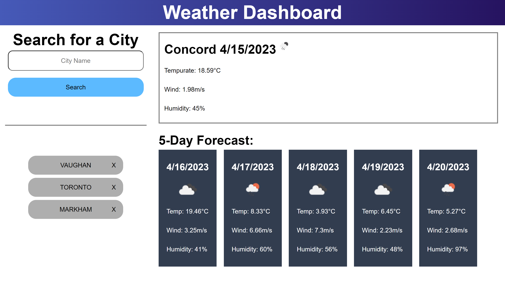
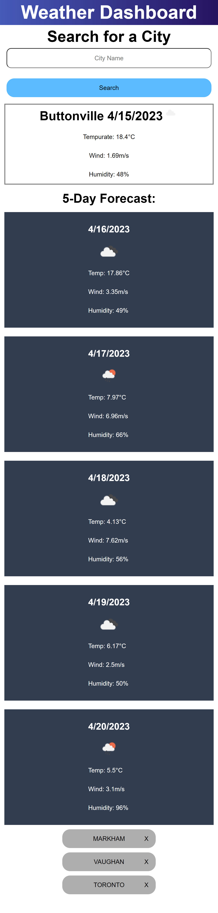

# Weather-Dashboard

## Description

This project is to learn how to use server-sided API

This project requires 2 API, one is a 5 day / 3 Hour forecast, the other is Geocoding API.

Geocoding API takes a city name and gives back the Latitude and Longitude

5 Day / 3 Hour API requires the Latitude and Longitude from geocoding API to get the forecast data

This project gave me practice on how to navigate through the responses of the API, and practice with understanding Documentation of serversided API.

## Usage

There is a Input field and a button to submit. When a city name is entered in the field and the search button is pressed. It will display current weather conditions beside the input form and under the current weather will display the next 5 day weather forecast. Under the input form, it will list the search histories.

You can see there is a small discrepancy when searching the city. When Vaughan is searched the API returns Concord which shares Latitude and Longitude with each other, same thing with Markham, it will display Buttonville because the Latitude and Longitude are the same.

When a city you have searched before is already on the history list, it will put the most recent search at the top of the list.

When the "X" beside the city name in the search history is clicked, it will remove it from the search history.

The webpage is also responsive to viewport

Deployed URL: https://timebytes.github.io/Weather-Dashboard/

## Credit

Used the assignment mock up as design reference

## License

MIT License
